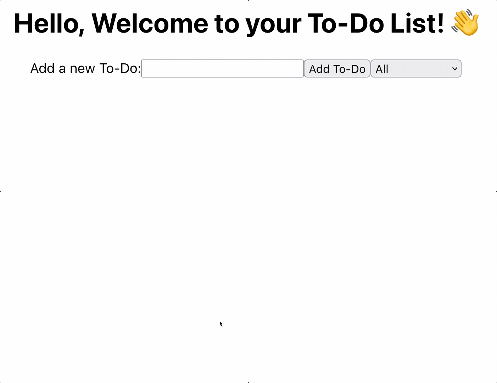

# ✅ To-Do List App

Hello 👋

Welcome to my first app built using React: A simple To-Do list

---

## 💻 Functionality

The To-Do app allows you to do the following:

- 📝 Add a To-Do
- 🗑️ Delete a To-Do
- ✅ Mark the To-Do as complete
- 🚦 Filter the To-Do items using the drop-down menu by:
  - All
  - Completed
  - Uncompleted

---

## 👀 Demonstration

---

## 🤔 Future Considerations

- [] Edit To-Do items
- [] Add priority tags to To-Do items
- [] Filter by priority
- [] Add to CSS styling
